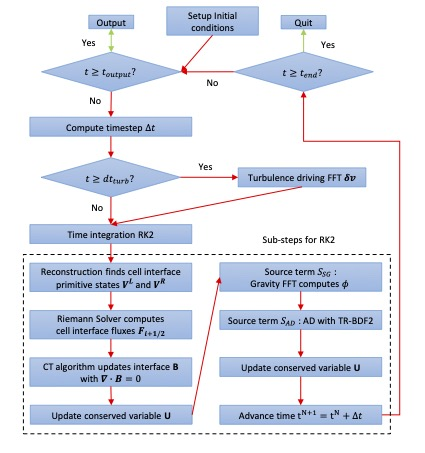
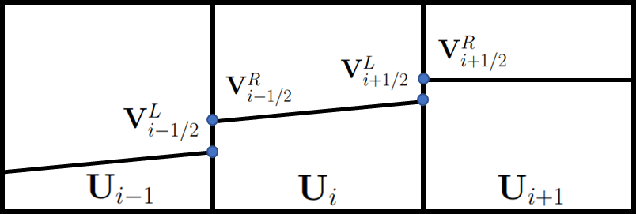
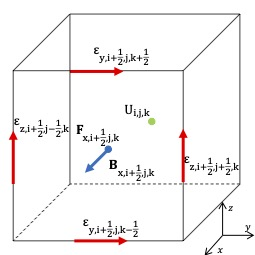

# Scorpio

<h2 align='center'>Overview </h2>

---

The Scorpio MHD code with two fluid ambipolar diffusion solvers will be released in the near future.

Scorpio is a grid-based two-fulid hydrodynamic (HD) and magnetohydrodynamic (MHD) code, with ambipolar diffusion (AD), self-gravity (SG) and turbulence driving.The development of Scorpio is led by Dr. Hsiang Hsu Wang based on his experiencewith the MHD code Antares and inspired by our AD observation on NGC 6334 (Tanget al. 2018). Both Antares and NGC 6334 belong to the Scorpio constellation, thus the name of the code.

- Written in FORTRAN and MPI-parallelized.
- Based on Godunov-type shock-capturing finite volume method, the conservation parts are evolved in second-order of accuracy both in space and time, includingRiemann solvers (HLL, HLLC, HLLD) combined with a piecewise linear method(PLM) interpolation and Minmod limiter.
- The Poisson’s equation for self-gravity is solved using Fast Fourier Transformation(FFT) method.
- Turbulence driving to perturb velocity field using FFT.
- The collision term of ambipolar diffusion is integrated using semi-implicit method to overcome the stiffness.
- Time integration with the second-order Runge-Kutta method (RK2).
- Several featured test cases are presented to demonstrate the accuracy of Scorpio.

---

 
 
 
 
<h2 align='center'>Introduction </h2>

---

- In weakly ionized environments such as molecular clouds of ionization ratio $\sim 10^{-9} − 10^{-6}$, where the non-ideal effect, ambipolar diffusion (AD), plays an important role, decoupling of ions and neutrals cannot be ignored.
- Single-fluid ideal MHD approach cannot cater our needs to study the physics of ions and neutrals accurately. Due to computational complexity, simplified approaches such as single-fluid strong coupling approximation and two-fluid heavy-ion approximation are commonly adopted in expense of accuracy.
- Therefore, we developed a novel two-fluid non-ideal MHD code including AD effect to better capture the physics of ions and neutrals using the AD model [(Draine, 1986)](<https://doi.org/10.1016/0038-1101(86)90210-8>).
- Ambipolar diffusion has been observationally confirmed by [Li and Houde (2008)](https://iopscience.iop.org/article/10.1086/529581), where the decoupling of ions and neutrals is shown in the turbulent velocity dispersion spectra. [Tang et al. (2018)](https://iopscience.iop.org/article/10.3847/1538-4357/aacb82/meta) has shown that the ion-neutral decoupling scale is smaller than $0.4$ pc by observing HCO+ and HCN, in which the decoupling scale is larger than the molecular cloud core. The AD model further studies the issue in disk formation.

  
   
  
Figure 1: Flowchart of Scorpio.

---

 
 
 
 
<h2 align='center'>Governing equations</h2>

---

The conservative form: conserved variables $\mathbf{U}$, convective fluxes $\mathbf{F\_s} (\mathbf{U})$, self-gravity $\mathbf{S\_{G}}$, ambipolar diffusion $\mathbf{S\_{AD}}$

$$
\mathbf{U} =
		\begin{pmatrix}
			\rho\_n \\
			\rho\_n \mathbf{v\_n} \\
			E\_n\\
			\rho\_i \\
			\rho\_i \mathbf{v\_i} \\
			\mathbf{B} \\
			E\_i
		\end{pmatrix},
$$

$$
	\mathbf{F\_s} (\mathbf{U}) =
	\begin{pmatrix}
		\rho\_n v\_{s,n}\\
		\rho\_n v\_{s,n} \mathbf{v\_n} + p\_n\mathbf{I}\\
		(E\_n+p\_n)v\_{s,n}\\
		\rho\_i v\_{s,i}\\
		\rho v\_{s,i} \mathbf{v\_i} + p\_{t,i}\mathbf{I} - B\_s\mathbf{B}\\
		v\_{s,i}\mathbf{B} - B\_s\mathbf{v\_i}\\
		(E\_i+p\_{t,i})v\_{s,i} - B\_s(\mathbf{v\_i}\cdot B)
	\end{pmatrix},
$$

$$
	\mathbf{S\_{G}}(\mathbf{U}) =
\begin{pmatrix}
	0\\
	-\rho\_n\nabla\phi\\
	-\rho\_n\mathbf{v\_n}\cdot\nabla\phi\\
	0\\
	-\rho\_i\nabla\phi\\
	0\\
	-\rho\_i\mathbf{v\_i}\cdot\nabla\phi
\end{pmatrix},
$$

$$
\mathbf{S\_{AD}(\mathbf{U})} =
\begin{pmatrix}
	0\\
	-\alpha\rho\_i\rho\_n(\mathbf{v\_n}-\mathbf{v\_i})\\
	\frac{3\alpha}{\mu\_i+\mu\_n}\left[\mu\_i\rho\_n\epsilon\_i(\Gamma\_i-1)-\mu\_n\rho\_i\epsilon\_n(\Gamma\_n-1)\right]+\alpha\frac{\mu\_i}{\mu\_i+\mu\_n}\rho\_i\rho\_n(\mathbf{v\_n}-\mathbf{v\_i})^2\\
	0\\
	\alpha\rho\_i\rho\_n(\mathbf{v\_n}-\mathbf{v\_i})\\
	0\\
	\frac{3\alpha}{\mu\_i+\mu\_n}\left[\mu\_n\rho\_i\epsilon\_n(\Gamma\_n-1)-\mu\_i\rho\_n\epsilon\_i(\Gamma\_i-1)\right]+\alpha\frac{\mu\_n}{\mu\_i+\mu\_n}\rho\_i\rho\_n(\mathbf{v\_n}-\mathbf{v\_i})^2\\
\end{pmatrix}
$$

---

 
 
 
 
<h2 align='center'>Methods for Convective Fluxes</h2>

---

The Godunov-type method involves solving Riemann problem combined with reconstruction
at the cell interfaces, which follows the procedure reconstruct-evolve-average.

1. Reconstruct primitive variables with a second-order slope limiter, in which van Leer and midmod limiters are available.

  

> > > 
Figure 2: 1-D illustration. Averaged cell-centred conserved variables Ui give the primitive variables $\textbf{V}_i = \left(\rho_n, \textbf{v}_n, p_n, \rho_i, \textbf{v}_i, p_i,\textbf{B}\right)^T$. PLM constructs the interpolated variables on right side $\textbf{V}^R_{i−1/2}$ at interface $i−\frac{1}{2}$ and the left side $\textbf{V}^L_{i+1/2}$ at interface $i + \frac{1}{2}$. Each pair of left- and right- state on the same interface $i + \frac{1}{2}$, $\textbf{V}^L_{i+1/2}$ and $\textbf{V}^R_{i+1/2}$, defines a Riemann problem.

2. Riemann solvers give the solutions based on the characteristic waves to calculate the convective fluxes on cell interfaces $\textbf{F}\_{l\_s+1/2}$. Scorpio implemented exact and the HLL family, where HLL and HLLC solvers for HD while HLL and HLLD solvers for MHD. Typically neutrals are solved with HLLC, while ions are usually solved with HLLD solver, which includes shock, rarefaction, contact, fast magnetosonic and Alfvén waves.

3. The cell-centered conserved variables Ui,j,k are updated in time from $N$ to $N + 1$ by

$$
\begin{aligned}
\textbf{U}^{N+1}\_{i,j,k} = \textbf{U}^{N}\_{i,j,k} &- \frac{\Delta t}{\Delta x} \left(
\textbf{F}\_{x,i+1/2,j,k} - \textbf{F}\_{x,i-1/2,j,k}
\right)\\
& - \frac{\Delta t}{\Delta x} \left(
\textbf{F}\_{x,i,j+1/2,k} - \textbf{F}\_{x,i,j-1/2,k}
\right) \\
&- \frac{\Delta t}{\Delta x} \left(
\textbf{F}\_{x,i,j,k+1/2} - \textbf{F}\_{x,i,j,k-1/2}
\right)
\end{aligned}
$$

- Constrained Transport Algorithm ensures magnetic flux conservation and divergence-free constraint $\nabla \cdot \textbf{B}$ on each grid cell. The electric fields (electromotive force or EMF) $\epsilon = - \textbf{v} \times \textbf{B}$ are line-averaged along the cell edges. The area-averaged magnetic fields are then evaluated on the cell-centred interface $\textbf{B}\_{i+1/2,j,k}$ by the induction equation.

  

> > > 
Figure 3: Illustration in Cartesian Coordinates. $\textbf{U}$ is the cell-centred volume-averaged conserved variables. The interface-centred area-averaged $x$-component of magnetic field $\textbf{B}_{x,i+1/2,j,k}$ coincides with interface flux $\textbf{F}_{x,i+1/2,j,k}$. Line-averaged EMF are located on the edges.

 
 
 
 
<h2 align='center'>Methods for Convective Fluxes </h2>

### Methods for Ambipolar Diffusion

A second-order accurate semi-implicit treatment [4], trapezoidal rule backward-difference
formula (TR-BDF2), is used to handle the stiff ambipolar diffusion source term $\textbf{S}\_{\textbf{AD}}$. The
two-fluid model takes the collisional term of ions and neutrals into account. Velocities
$\textbf{v}\_i$, $\textbf{v}\_n$, energies $E\_i$ and $E\_n$ are evolved based on $\textbf{S}\_{\textbf{AD}}$. The collisional coefficient is

$$
\alpha = \alpha\_0 \max
\left(
1, \frac{|v\_n - v\_i|}{19.0\;\text{km s}^{-1}}
\right),\quad
\alpha\_0 =
\frac{1.9 \times 10^{-19}}{m\_H (\mu\_n + \mu\_i)} \text{cm}^3\\,\text{s}^{-1}.
$$

 
 

### Methods for Self-Gravity

The Poisson’s equation of self-gravity $\textbf{S}\_\textbf{G}$ is solved using FFT with the global density $\tilde{\rho}(\textbf{k})$ in Fourier space and multiplying the Green’s function kernel,

$$
\tilde{\phi}(\textbf{k}) = −\tilde{\rho}(\textbf{k})/|\textbf{k}|^2.
$$

The gravitational potential in real space $\phi (\textbf{x})$ is obtained using backward FFT and taking the real part. Periodic and isolated boundary conditions are available.

 
 

### Methods for Turbulence Driving

For impulsive driving, energy is injected to the fluid at a constant energy input rate $dE\_{drv}/dt\_{drv}$. A field of velocity perturbations $\textbf{a}(\textbf{k})$ is set in Fourier space [[6]](). The perturbation power spectrum follows

$$
k^2|\textbf{a}(\textbf{k})|^2 / k^8 \exp (−8k/k\_0),
$$

where $k\_0$ is the driving scale. The mode $\zeta$  controls fraction of the compressive and solenoidal components in the velocity field such that

$$
 \delta\tilde{\textbf{v}}(\textbf{k}) = \underline{\underline{\textbf{P}}}(\textbf{k})\textbf{a}(\textbf{k}),
$$

$$
\textbf{P}\_{ij}(\textbf{k}) =  \zeta \delta\_{ij} + (1 − 2\zeta)k\_ik\_j/|\textbf{k}|^2.
$$

Purely solenoidal mode $\zeta = 1$ and purely compressive mode $\zeta = 0$ can be pictured as stirring and compression (e.g. shock waves) respectively. The velocity perturbations $\delta \textbf{v}(\textbf{x})$ are shifted to ensure there is no net momentum added.

---

 
 
 
 
 
 

---

More test cases for HD, MHD and ADMHD are available in
[https://github.com/SFG-CUHK/scorpio-test-cases/wiki](https://github.com/SFG-CUHK/scorpio-test-cases/wiki).
