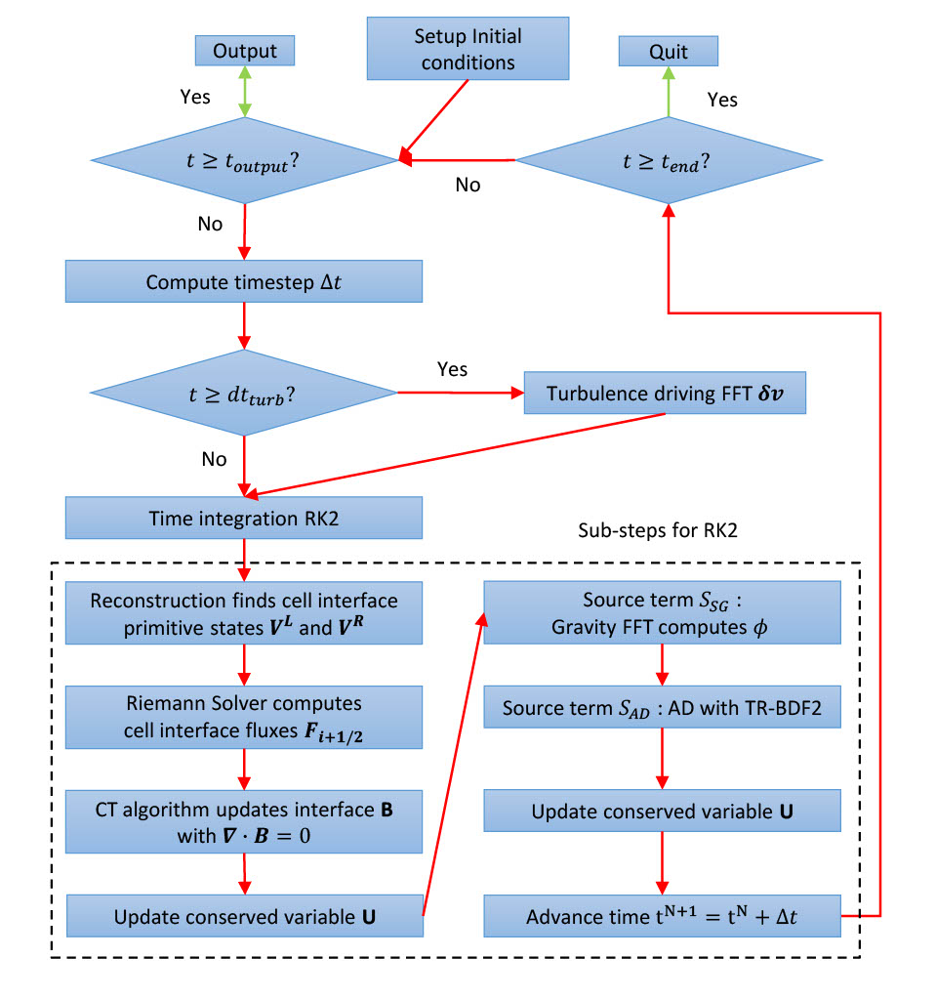

# Scorpio

<h2 align='center'>Overview </h2>

---

The Scorpio MHD code with two fluid ambipolar diffusion solvers will be released in the near future.

Scorpio is a grid-based two-fulid hydrodynamic (HD) and magnetohydrodynamic (MHD) code, with ambipolar diffusion (AD), self-gravity (SG) and turbulence driving.The development of Scorpio is led by Dr. Hsiang Hsu Wang based on his experiencewith the MHD code Antares and inspired by our AD observation on NGC 6334 (Tanget al. 2018). Both Antares and NGC 6334 belong to the Scorpio constellation, thus the name of the code.

- Written in FORTRAN and MPI-parallelized.
- Based on Godunov-type shock-capturing finite volume method, the conservationparts are evolved in second-order of accuracy both in space and time, includingRiemann solvers (HLL, HLLC, HLLD) combined with a piecewise linear method(PLM) interpolation and Minimod limiter.
- The Poisson’s equation for self-gravity is solved using Fast Fourier Transformation(FFT) method.
- Turbulencing driving to perturb velocity field using FFT.
- The collision term of ambipolar diffusion is integrated using semi-implicit methodto overcome the stiffness.
- Time integration with the second-order Runge-Kutta method (RK2).
- Several featured test cases are presented to demonstrate the accuracy of Scorpio.

---

 
 
 
 
<h2 align='center'>Introduction </h2>

---

- In weakly ionized environments such as molecular clouds of ionization ratio ~ 10-9 − 10-6, where the non-ideal effect, ambipolar diffusion (AD), plays an important role, decoupling of ions and neutrals cannot be ignored.
- Single-fluid ideal MHD apporach cannot cater our needs to study the physics of ions and neutrals accurately. Due to computational complexity, simplified approaches such as single-fluid strong coupling approximation and two-fluid heavy-ion approximation are commonly adopted in expense of accuracy.
- Therefore, we developed a novel two-fluid non-ideal MHD code including AD effect to better capture the physics of ions and neutrals using the AD model [(Draine, 1986)](<https://doi.org/10.1016/0038-1101(86)90210-8>).
- Amipolar diffusion has been observationally confirmed by [Li and Houde (2008)](https://iopscience.iop.org/article/10.1086/529581), where the decoupling of ions and neutrals is shown in the turbulent velocity dispersion spectra. [Tang et al. (2018)](https://iopscience.iop.org/article/10.3847/1538-4357/aacb82/meta) has shown that the ion-neutral decoupling scale is smaller than 0.4 pc by observing HCO+ and HCN, in which the decoupling scale is larger than the molecular cloud core. The AD model further studies the issue in disk formation.

   
  
   
  
Figure 1: Flowchart of Scorpio.

   

---

 
 
 
 
<h2 align='center'>Methods for Convective Fluxes </h2>

---

The Godunov-type method involves solving Riemann problem combined with reconstruction
at the cell interfaces, which follows the procedure reconstruct-evolve-average.

1. Reconstruct primitive variables with a second-order slope limiter, in which van Leer and midmod limiters are available.

   
  
   

- Figure 2: 1-D illustration. Averaged cell-centred conserved variables Ui give the primitive variables $\textbf{V}_i = ( \rho_n, \textbf{v}_n, p_n, \rho_i, \textbf{v}_i, p_i,\textbf{B})^T$ . PLM constructs the interpolated variables on right side $\textbf{V}^R_{i−1/2}$ at interface $i−\frac{1}{2}$ and the left side $\textbf{V}^L_{i+1/2}$ at interface $i + \frac{1}{2}$. Each pair of left- and right- state on the same interface $i + \frac{1}{2}$ , $\textbf{V}^L_{i+1/2}$ and $\textbf{V}^R_{i+1/2}$, defines a Riemann problem.

2. Riemann solvers give the solutions based on the characteristic waves to calculate the convective fluxes on cell interfaces $\textbf{F}_{l_s+1/2}$. Scorpio implemented exact and the HLL family, where HLL and HLLC solvers for HD while HLL and HLLD solvers for MHD. Typically neutrals are solved with HLLC, while ions are usually solved with HLLD solver, which includes shock, rarefaction, contact, fast magnetosonic and Alfvén waves.

 
 
 
 
 
 

---

Read the [Scorpio Wiki](https://github.com/SFG-CUHK/scorpio-test-cases/wiki) for more details and test cases.
